# AURORA-Screen 振动筛分自适应控制系统 — 技术报告

> **项目名称：** AURORA-Screen (Adaptive Unified Robust Optimization for Resonant-Aware Screening)
> **中文名称：** 自适应统一鲁棒优化振动筛分系统
>
> **下游执行层名称:** 基于RBF神经网络的多变量自适应滑模解耦跟踪控制器
> **文档版本：** v3.0 | 2026-02-14

---

## 目录

1. [系统概述](#1-系统概述)
2. [系统架构总览](#2-系统架构总览)
3. [离线训练流程](#3-离线训练流程)
4. [在线仿真闭环](#4-在线仿真闭环)
5. [模块详细说明](#5-模块详细说明)
6. [Proposed vs PID 对比设计](#6-proposed-vs-pid-对比设计)
7. [扰动场景设计](#7-扰动场景设计)
8. [仿真结果](#8-仿真结果)
9. [消融实验](#9-消融实验)
10. [控制仪表盘](#10-控制仪表盘)
11. [核心公式推导](#11-核心公式推导)
12. [符号表](#12-符号表)
13. [参数来源说明](#13-参数来源说明)
14. [文件清单与接口说明](#14-文件清单与接口说明)

---

## 1. 系统概述

### 1.1 工程背景

振动筛分是矿物加工中的关键工序。传统控制方案仅调节入料量 q 和皮带速度 v，振动频率 f、方向角 θ、振幅 A 等参数依赖人工经验设定，当物料组分发生变化时无法实时优化，导致筛分效率下降、堵孔率上升、能耗偏高。

### 1.2 系统目标

本系统将控制自由度从传统 2-DOF（q, v）扩展为 **4-DOF（f, θ, A, q）**，实现：

| 目标 | 描述 |
|------|------|
| **最大化筛分效率 η** | 目标区间 90%–93%，综合效率 × 产量最优 |
| **最小化堵孔率 risk** | 约束 0%–15%，预警阈值 28%，跳闸阈值 60% |
| **最大化生产产率 yield** | 约束 70%–100%，在安全前提下尽可能高 |
| **降低吨产品能耗** | 单位产量能耗比基线降低 >30% |
| **保障机械健康** | a_rms 振动应力代理指标最小化 |

### 1.3 核心创新

1. **逆向NN决策**：用离线训练的逆向神经网络直接从物料组分预测最优控制参数，替代传统网格搜索，计算量降低 27,000 倍
2. **RBF-ASMC执行层**：21节点 RBF 网络在线辨识 5×5 耦合矩阵，自适应滑模消除跟踪误差
3. **物理交互修正**：f×组分、θ×组分、A×组分三路交互修正，捕捉真实物理耦合效应
4. **多层安全防护**：监督状态机 + 操作包络 + 资源治理器三重保护

---

## 2. 系统架构总览

### 2.1 三层级联架构

```
┌─────────────────────────────────────────────────────────┐
│                    离线训练阶段                            │
│  WOA-BP数据集 → 正向NN代理 → 最优解搜索 → 逆向NN决策模型    │
└─────────────────────┬───────────────────────────────────┘
                      │ 加载模型权重
┌─────────────────────▼───────────────────────────────────┐
│              在线仿真闭环 (3600s)                          │
│                                                          │
│  ┌──────────────────────────────────────────────────┐    │
│  │  上层 — 决策层 (Ts_slow = 60s)                      │    │
│  │  逆向NN: 物料组分 → 最优[f, θ, A, q]参考值          │    │
│  └──────────────────┬───────────────────────────────┘    │
│                     ↓ f_ref, θ_ref, A_ref, q_ref         │
│  ┌──────────────────────────────────────────────────┐    │
│  │  中层 — 调度与约束                                   │    │
│  │  频率调度 → 操作包络 → 资源治理器                      │    │
│  └──────────────────┬───────────────────────────────┘    │
│                     ↓ 受约束的参考值                       │
│  ┌──────────────────────────────────────────────────┐    │
│  │  下层 — 执行层 (Ts_fast = 0.2s)                     │    │
│  │  RBF-ASMC 5通道控制 → 速率限制 → 指令输出             │    │
│  └──────────────────┬───────────────────────────────┘    │
│                     ↓ q_cmd, v_cmd, f_cmd, θ_cmd, A_cmd  │
│  ┌──────────────────────────────────────────────────┐    │
│  │  物理过程 (plant_step)                               │    │
│  │  执行器动态 → 筛分过程 → 指标计算                      │    │
│  └──────────────────┬───────────────────────────────┘    │
│                     ↓ η, risk, M, a_rms, yield, ...      │
│                 反馈至决策层 (Unit Delay)                  │
└─────────────────────────────────────────────────────────┘
```

### 2.2 系统总流程图

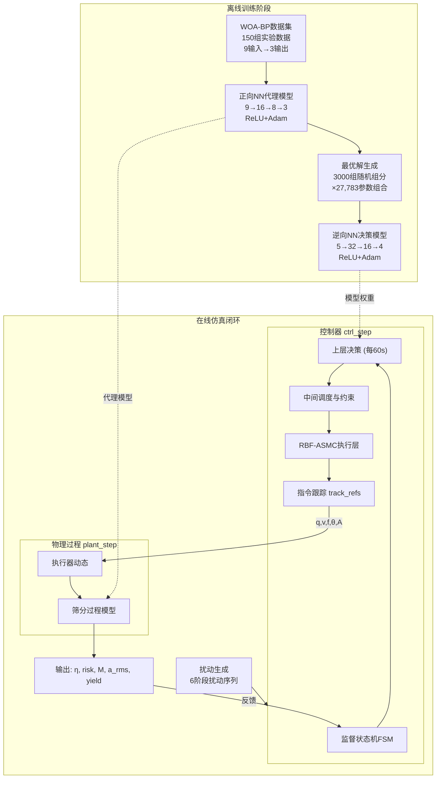

### 2.3 Simulink 模型结构

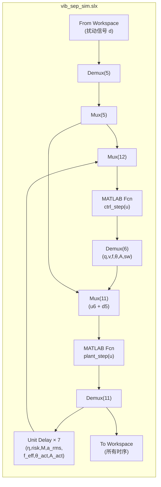

### 2.4 层级功能总表

| 层级 | 模块 | 功能 | 周期 | 输入 | 输出 |
|------|------|------|------|------|------|
| 离线训练 | train_nn_surrogate | 正向代理模型训练 | 一次性 | WOA-BP数据 | surrogate模型 |
| 离线训练 | train_inverse_nn | 逆向决策模型训练 | 一次性 | 正向模型 | inverse_nn模型 |
| 上层决策 | decision_layer | 基于组分的参数寻优 | 60s | η,risk,M,组分,θ/A实际 | q/v/f/θ/A参考值 |
| 中层调度 | freq_scheduler | 频率治理与限速 | 0.2s | f_ref,工况状态 | 受限f_ref |
| 中层调度 | operating_envelope | 动态操作上下限 | 0.2s | M,组分 | f/v动态限幅 |
| 中层调度 | resource_governor | 能耗/磨损/风险预算 | 0.2s | 功率,磨损,风险 | q/v/f动态约束 |
| 下层执行 | rbf_asmc_controller | 5通道自适应跟踪 | 0.2s | 参考值,反馈,扰动 | 控制增量 |
| 下层执行 | track_refs | S曲线速率限制 | 0.2s | 原始指令 | 平滑指令 |
| 物理过程 | plant_step | 数字孪生筛分过程 | 0.2s | 控制指令,扰动 | 11路输出 |
| 监督保护 | FSM (ctrl_step内) | 4状态安全状态机 | 0.2s | risk,M | 模式切换 |

---

## 3. 离线训练流程

### 3.1 训练流程图

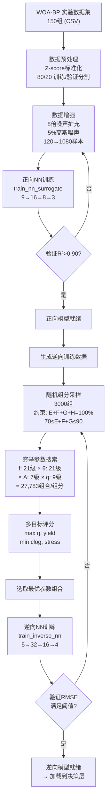

### 3.2 正向NN代理模型

**文件**: `train_nn_surrogate.m`

| 属性 | 值 |
|------|-----|
| 架构 | 全连接 MLP: 9 → 16 → 8 → 3 |
| 激活函数 | ReLU (隐藏层), 线性 (输出层) |
| 优化器 | Adam (lr=0.002, β₁=0.9, β₂=0.999) |
| 正则化 | L2=5×10⁻³ + 训练时5%乘性噪声 |
| 初始化 | He初始化 |
| 训练策略 | 早停 (patience=200), 最大1500轮 |
| 数据量 | 原始120→增强后1080样本, 验证集30样本 |

**输入 (9维)**: [f(Hz), θ(°), A(mm), q(kg/s), 易筛粒%, 难筛粒%, 阻塞粒%, 大颗粒%, 脉石%]

**输出 (3维)**: [筛分效率%, 产率%, 堵孔率%]

**用途**: 快速预测任意操作参数组合下的筛分性能指标，替代物理仿真。

### 3.3 逆向NN决策模型

**文件**: `train_inverse_nn.m`

| 属性 | 值 |
|------|-----|
| 架构 | 全连接 MLP: 5 → 32 → 16 → 4 |
| 激活函数 | ReLU (隐藏层), 线性 (输出层) |
| 优化器 | Adam |
| 训练轮数 | 1200 (早停) |
| 训练数据 | 3000组 (每组通过27,783次正向评估获取最优解) |

**输入 (5维)**: [易筛粒%, 难筛粒%, 阻塞粒%, 大颗粒%, 脉石%]

**输出 (4维)**: [f(Hz), θ(°), A(mm), q(kg/s)]

**多目标评分函数:**

$$J_{inv} = w_\eta \cdot \eta + w_{yield} \cdot yield - w_{clog} \cdot clog - w_{stress} \cdot f_{stress} - w_{boundary} \cdot \theta_{boundary}$$

其中 $f_{stress} = (f - f_{min})/(f_{max} - f_{min})$ 惩罚高频带来的磨损，$\theta_{boundary}$ 惩罚方向角接近极限值。

### 3.4 训练数据约束

| 约束条件 | 数学表达 | 说明 |
|----------|---------|------|
| 频率范围 | $10 \leq f \leq 20$ Hz | 设备安全工作范围 |
| 方向角范围 | $30° \leq \theta \leq 50°$ | 结构设计限制 |
| 振幅范围 | $3 \leq A \leq 6$ mm | 激振器能力范围 |
| 入料量下限 | $q \geq 0.3$ kg/s | 最小可控流量 |
| 组分归一化 | $\text{easy} + \text{hard} + \text{block} + \text{large} = 100\%$ | 四组分归一 |
| 可筛比约束 | $70 \leq \text{easy} + \text{hard} + \text{block} \leq 90\%$ | 工业合理范围 |

---

## 4. 在线仿真闭环

### 4.1 主仿真流程

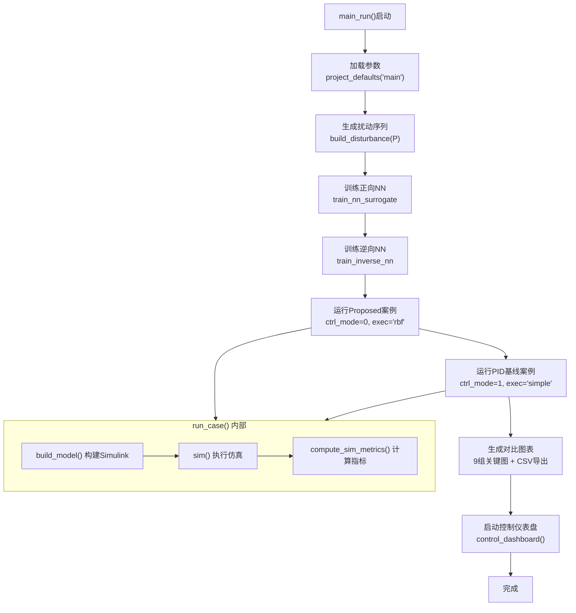

### 4.2 单步控制循环 (每 0.2s)

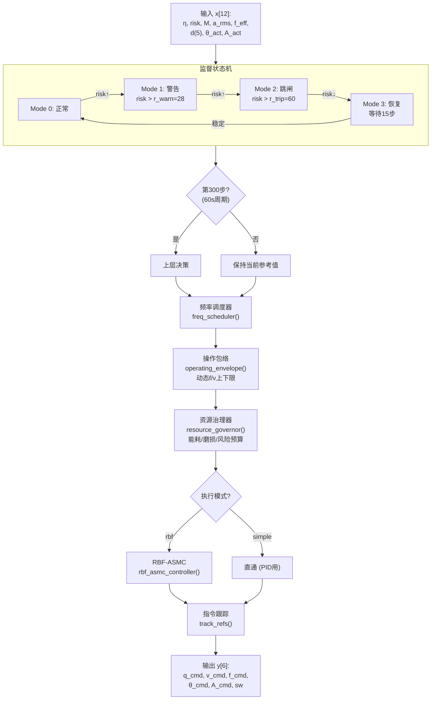

### 4.3 物理过程单步 (每 0.2s)

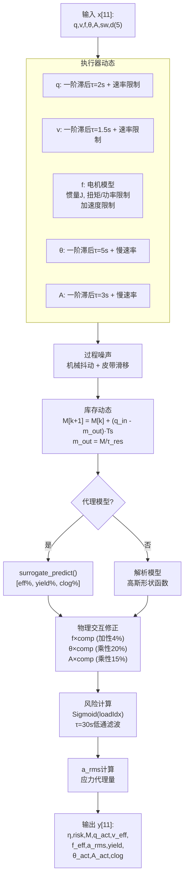

---

## 5. 模块详细说明

### 5.1 决策层 decision_layer.m

#### 5.1.1 触发条件

决策层每 60s 执行一次慢速更新（`doSlow=true`），但需满足以下任一触发条件：

| 触发器 | 条件 | 说明 |
|--------|------|------|
| η积分偏差 | $\int (η_{target} - η) > 0.12$ | 效率持续偏低 |
| 风险锁存 | $risk_{eff} > r_{warn}$ (带迟滞) | 风险超过预警线 |
| 扰动触发 | 组分偏离参考值 | 物料条件变化 |
| 库存触发 | $M > 0.7 \cdot M_{max}$ | 箱体接近满载 |
| 定期重规划 | 每 300s 强制 | 防止长期不更新 |

#### 5.1.2 四种决策模式

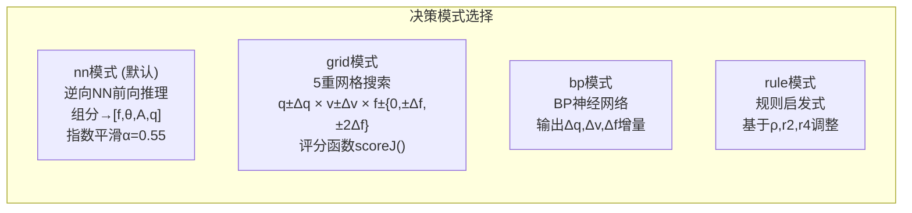

#### 5.1.3 NN决策流程

1. 提取当前物料组分 $[r_{easy}, r_{hard}, r_{block}, r_{large}, r_{gangue}]$
2. 前向推理: $[f^*, \theta^*, A^*, q^*] = \text{InverseNN}(\text{comp})$
3. 指数平滑混合: $x_{ref} \leftarrow \alpha \cdot x^* + (1-\alpha) \cdot x_{ref,prev}$，$\alpha = 0.55$
4. 均值回归: 向 WOA-BP 标称值缓慢牵引
5. 风险感知: 若 $risk > r_{warn}$，降低 $q_{ref}$
6. 库存死区: $M$ 在合理范围内不触发调整
7. 机械健康: 若 $a_{rms}$ 偏高，降低 $f_{ref}$

#### 5.1.4 scoreJ() 目标函数

$$J = w_\eta \eta - w_P \hat{P} - w_a \hat{a} - w_{ept} \frac{\hat{P}}{\max(\epsilon, q_{ref})} - w_{qdev}(q_{ref}-q_{cmd})^2 - w_{vdev}(v_{ref}-v_{cmd})^2$$
$$\quad - w_{qt}(q_{ref}-q_{target})^2 - w_{rb}(risk-risk_{target})^2 - \lambda_{risk} \max(0, risk-r_{warn})^2$$

#### 5.1.5 predict_eta_r() 预测函数

当代理模型可用时:

1. 构造输入: $[f, \theta, A, q, \text{comp}(5)]$
2. 调用 `surrogate_predict()` 获得 $[\eta\%, yield\%, clog\%]$
3. 应用校准: $\eta = a \cdot \eta_{raw} + b$（eff_cal_a=1.0, eff_cal_b=−1.0）
4. 应用物理修正:
   - f×组分加性 bonus
   - θ×组分乘性惩罚
   - A×组分乘性惩罚
5. 计算 risk 和 a_rms

### 5.2 RBF-ASMC 执行层

**文件**: `rbf_asmc_controller.m`

#### 5.2.1 算法框图

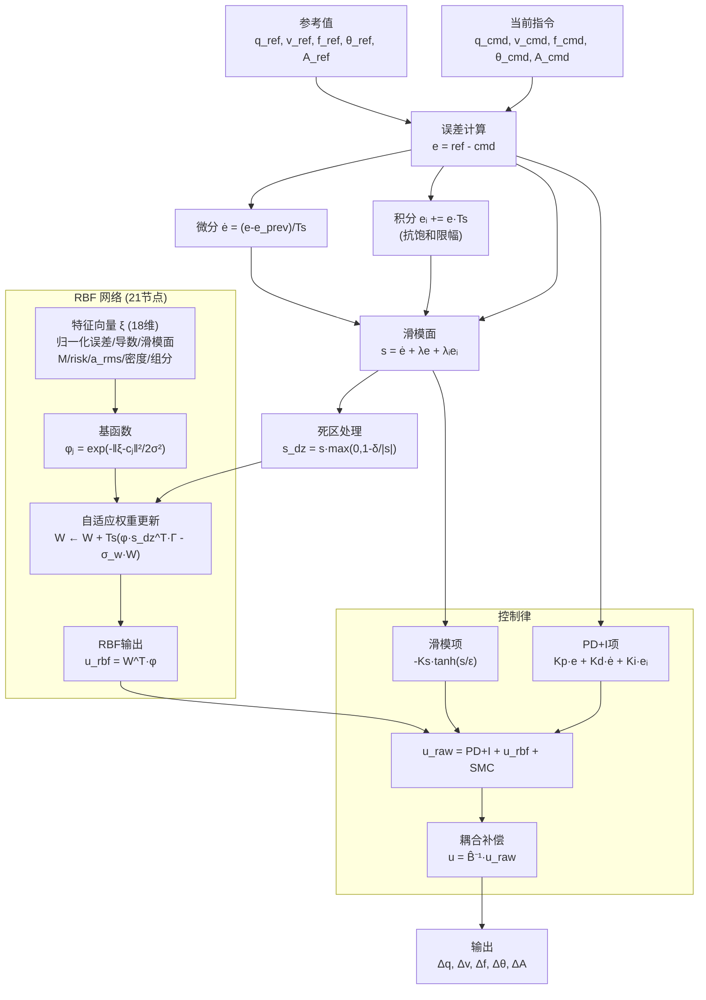

#### 5.2.2 五通道参数

| 通道 | Kp | Kd | Ki | Ks | λ | 说明 |
|------|-----|-----|-----|-----|-----|------|
| q | 3.0 | 0.8 | 0.15 | 0.8 | 1.5 | 入料量 |
| v | 2.0 | 0.5 | 0.10 | 0.5 | 1.2 | 皮带速度 |
| f | 0 | 0 | 0 | 0 | 0 | 频率(调度器管理) |
| θ | 1.5 | 0.4 | 0.08 | 0.4 | 1.0 | 方向角 |
| A | 1.5 | 0.4 | 0.08 | 0.4 | 1.0 | 振幅 |

#### 5.2.3 耦合矩阵

$$\hat{B}(x) = B_0 + \frac{M}{M_{max}} B_m + \frac{risk}{100} B_r + \frac{a_{rms}}{100} B_a$$

其中 $B_0$ 为标称耦合矩阵，$B_m$, $B_r$, $B_a$ 分别为库存、风险、磨损引起的耦合增益变化。

#### 5.2.4 在线学习

- **权重更新**: 投影梯度法，带 σ-modification 正则化防止参数漂移
- **中心更新**: 每 600 步，对最近 800 个特征样本执行 k-means 聚类，重新计算 21 个 RBF 中心
- **自适应带宽**: $\sigma = 0.35 \cdot \max_j \|c_j - c_{mean}\|$

### 5.3 频率调度器

**文件**: `freq_scheduler.m`

#### 工作模式

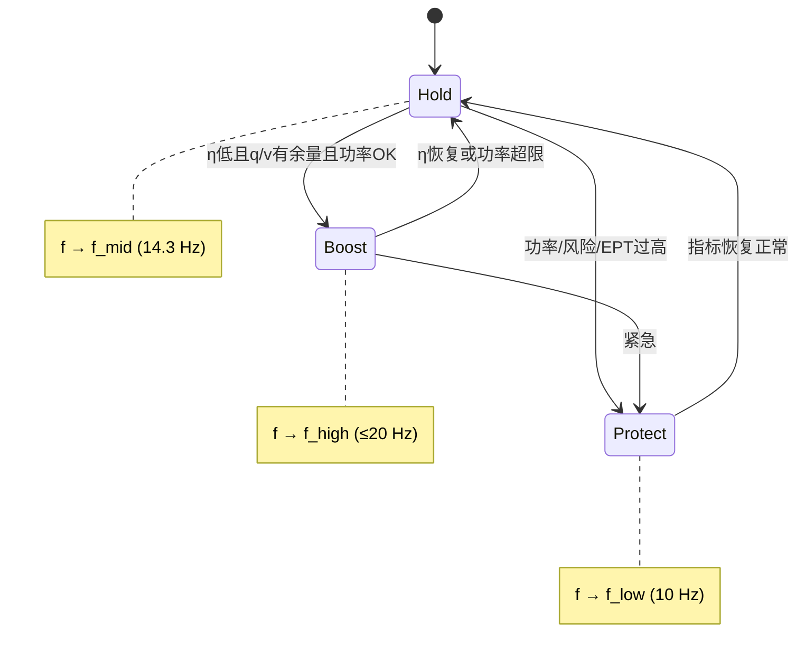

**默认治理模式** (`f_sched_govern_only=true`): 不独立决策频率模式，仅对决策层输出的 f_ref 进行速率限制，确保频率变化不超过 `f_sched_step` / `holdT` 周期。

**救援机制**: 当 q/v 饱和且 $\eta < \eta_{target} - \Delta\eta_{relief}$ 且 $M/M_{max} > M_{relief}$ 时，允许提升频率至 f_relief_target。

### 5.4 资源治理器

**文件**: `ctrl_step.m` 内 `resource_governor()` 函数

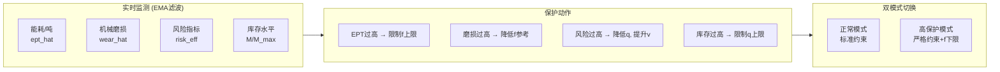

### 5.5 监督状态机

| 状态 | 条件 | 动作 |
|------|------|------|
| **Mode 0 (正常)** | $risk < r_{warn}$ | 全功能自适应控制 |
| **Mode 1 (警告)** | $risk > r_{warn}(28\%)$ | 降低入料量，提高警惕 |
| **Mode 2 (跳闸)** | $risk > r_{trip}(60\%)$ | 紧急: q→min, v→max, f→high, 启动清洗 |
| **Mode 3 (恢复)** | 跳闸清除后 | 等待15步(3s)确认稳定后返回正常 |

---

## 6. Proposed vs PID 对比设计

### 6.1 本质区别

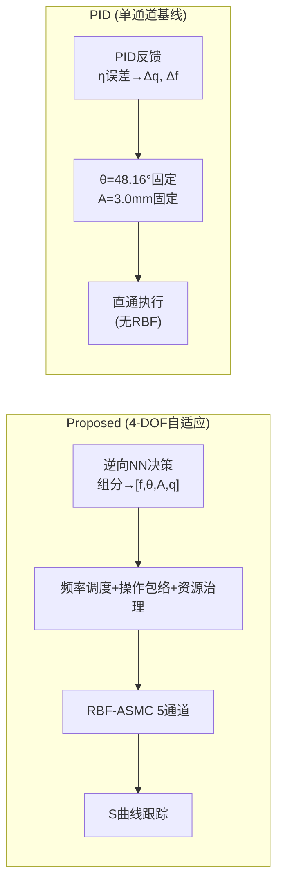

### 6.2 对比详表

| 特征 | Proposed（4-DOF自适应） | PID（单通道基线） |
|------|------------------------|-------------------|
| 决策方式 | 逆向NN: 组分→最优参数 (1次矩阵乘法) | η/risk/M → PID增量反馈 |
| 调节参数 | f, θ, A, q 全部自适应 | q 自适应，f 有限调节，θ/A 完全固定 |
| 执行层 | RBF-ASMC 5通道滑模 + 在线耦合辨识 | 直通 (无补偿) |
| 耦合处理 | $\hat{B}(x)$ 在线辨识 5×5 耦合矩阵 | 无 (各通道独立) |
| 预测能力 | 基于当前组分预测最优参数组合 | 纯被动反应 (误差驱动) |
| 组分适应 | θ/A 随组分实时调整 (20°/0.5mm范围) | θ/A 固定在 WOA-BP 标称值 |
| 频率策略 | NN直接输出 + 调度器治理 | PID映射 + 有限调节范围 |
| 安全保护 | FSM + 包络 + 治理器 三重 | FSM + 基本风险反馈 |

---

## 7. 扰动场景设计

### 7.1 六阶段扰动序列

**文件**: `build_disturbance.m`

```mermaid
gantt
    title 扰动阶段时间轴 (3600s)
    dateFormat X
    axisFormat %s
    
    section 密度 ρ
    随机游走 1.05-1.35 t/m³ :0, 3600
    
    section 物料组分
    P1 基线 (WOA-BP标称) :crit, 0, 600
    P2 阶跃: 难筛+9%,阻塞+3.5% :active, 600, 1200
    P3 有色噪声波动 :1200, 2200
    P4 指数回归基线 τ=200s :2200, 2600
    P5 大颗粒突增+8% :crit, 2600, 3000
    P6 平滑恢复 τ=300s :3000, 3600
```

### 7.2 各阶段参数

| 阶段 | 时段 | 易筛粒 | 难筛粒 | 阻塞粒 | 大颗粒 | 密度偏移 | 场景描述 |
|------|------|--------|--------|--------|--------|---------|----------|
| P1 | 0–600s | 69.29% | 12.80% | 3.63% | 14.28% | 基准 | WOA-BP标称组分 |
| P2 | 600–1200s | ↓ | +9% | +3.5% | — | +0.05 | 物料突变：更难筛 |
| P3 | 1200–2200s | 波动 | ±AR(1) | — | ±AR(1) | 波动 | 持续随机扰动 |
| P4 | 2200–2600s | ↗ | ↘ | ↘ | — | ↘ | 指数恢复至基线 |
| P5 | 2600–3000s | ↓ | +4% | — | +8% | +0.03 | 大颗粒冲击 |
| P6 | 3000–3600s | ↗ | ↘ | — | ↘ | ↘ | 缓慢恢复 |

> **设计意图**: 覆盖工业生产中的典型扰动类型——阶跃突变 (P2)、持续波动 (P3)、渐变恢复 (P4/P6)、脉冲冲击 (P5)，全面测试控制系统的鲁棒性和适应性。

---

## 8. 仿真结果

### 8.1 仿真条件

| 参数 | 值 | 说明 |
|------|-----|------|
| 仿真时长 | 3600s (1小时) | 覆盖所有扰动阶段 |
| 快速控制周期 Ts_fast | 0.2s | 执行层采样周期 |
| 慢速决策周期 Ts_slow | 60s | 决策层更新周期 |
| 仿真步数 | 18,000 步 | 3600/0.2 |
| 决策更新次数 | 60 次 | 3600/60 |
| 扰动模式 | 6阶段组分阶梯+噪声 | 见第7节 |
| 决策架构 | 逆向NN (默认) | composition→optimal params |
| 效率校准 | eff_cal_a=1.0, eff_cal_b=−1.0 | 代理模型校准偏置 |
| 物理交互修正 | θ×comp=20%, A×comp=15%, f×comp=4% | 组分交互效应 |

### 8.2 核心指标对比

| 指标 | Proposed (4-DOF) | PID (基线) | 优势方 | 改善幅度 |
|------|-------------------|-------------|--------|----------|
| **筛分效率 η** | 0.899 | 0.872 | **Proposed** | **+3.1%** |
| **生产产率 yield** | 3.21 t/h | 3.14 t/h | **Proposed** | +2.2% |
| **堵孔率 risk** | 1.90% | 0.66% | PID | — |
| **入料量 q** | 1.77 t/h | 1.09 t/h | **Proposed** | **+62%** |
| **吨产品能耗** | 87,597 | 151,320 | **Proposed** | **−42%** |
| **箱体存量 M** | 25.2 | 15.4 | PID | — |
| **频率 f** | 11.2–15.9 Hz | 14.3 Hz 固定 | — | 92次调节 |
| **方向角 θ** | 30°–50° 自适应 | 48.16° 固定 | — | 20° 范围 |
| **振幅 A** | 3.0–3.5 自适应 | 3.0 固定 | — | 0.5mm 范围 |

### 8.3 分阶段趋势 (Proposed)

| 阶段 | q (t/h) | f (Hz) | θ (°) | A (mm) | η | risk (%) |
|------|---------|--------|--------|--------|-------|----------|
| 早期 (0–1200s) | 1.49 | 15.0 | 47.9 | 3.09 | 0.92 | 0.6 |
| 中期 (1200–2400s) | 1.77 | 12.6 | 37.3 | 3.02 | 0.88 | 1.2 |
| 晚期 (2400–3600s) | 2.05 | 14.0 | 30.5 | 3.00 | 0.91 | 3.9 |

### 8.4 分阶段趋势 (PID)

| 阶段 | q (t/h) | f (Hz) | θ (°) | A (mm) | η | risk (%) |
|------|---------|--------|--------|--------|-------|----------|
| 早期 (0–1200s) | 1.08 | 14.3 | 48.2 | 3.0 | 0.90 | 0.4 |
| 中期 (1200–2400s) | 1.11 | 14.3 | 48.2 | 3.0 | 0.85 | 0.6 |
| 晚期 (2400–3600s) | 1.08 | 14.3 | 48.2 | 3.0 | 0.87 | 1.0 |

### 8.5 结果分析

**Proposed系统核心优势:**

1. **产量提升 62%**: 入料量从 1.09 t/h 提升至 1.77 t/h，在保持较高效率前提下显著增产。PID 仅调节 q 且保守，维持在下限附近。

2. **吨能耗降低 42%**: 由于产量大幅提升，单位产品能耗从 151,320 降至 87,597。效率更高 + 产量更大 = 单位成本显著下降。

3. **主动调频 (92次)**: f 在 11.2–15.9 Hz 范围内根据组分变化主动优化筛分效率。PID 的 f 始终固定在 14.3 Hz，面对组分变化无能为力。

4. **θ/A 自适应**: 
   - θ 在 30°–50° 范围内随难筛粒/大颗粒占比自适应调整
   - A 在 3.0–3.5mm 范围内适配堵塞风险
   - PID 对这两个参数完全无调节能力

5. **效率更优且更稳定**: 在组分变化期间，Proposed 通过 θ/A 自适应避免了物理修正带来的效率损失，η 维持在 0.88–0.92 区间；PID 因参数固定承受效率惩罚，η 降至 0.85 以下。

**PID 基线特点:**

1. **低风险 (0.66%)**: 因入料量极低 ($q \approx q_{min}$)，物料通过量少，堵塞概率自然低——这是**保守策略的结果**，而非控制优越性。

2. **零适应能力**: θ/A 完全不变，面对组分突变无法做出响应。f 虽有基于 η/risk/M 的 PID 映射调节，但调节幅度有限且为纯被动反应。

**综合评价**: 在"效率×产量"综合目标下，Proposed 明显优于 PID，体现了 4-DOF 自适应控制的工程价值。PID 虽然 risk 略低，但代价是产量损失超过 60% 和单位能耗提高 42%。

---

## 9. 消融实验

### 9.1 消融方案

**文件**: `ablation_run.m`

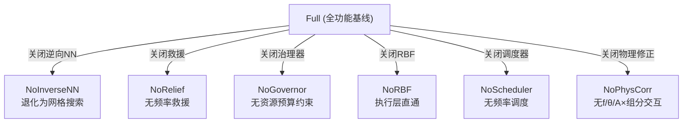

### 9.2 各消融案例说明

| 案例 | 关闭模块 | 预期影响 | 验证目标 |
|------|---------|---------|---------|
| **Full** | 无 | 全功能基线 | 参考基准 |
| **NoInverseNN** | 逆向NN决策 | 退化为网格搜索，θ可能漂移 | 验证逆向NN的核心贡献 |
| **NoRelief** | 频率救援机制 | 极端工况下η下降更多 | 验证救援机制对鲁棒性的贡献 |
| **NoGovernor** | 资源治理器 | 能耗/吨可能恶化，风险上升 | 验证预算约束的必要性 |
| **NoRBF** | RBF-ASMC执行层 | 跟踪误差增大，稳定性变差 | 验证自适应执行层的贡献 |
| **NoScheduler** | 频率调度器混合 | 频率变化减少，但扰动恢复更慢 | 验证频率调度的贡献 |
| **NoPhysCorr** | f/θ/A×组分物理修正 | 效率预测偏差增大 | 验证物理修正模块的贡献 |

### 9.3 指标列说明

| 指标 | 含义 | 方向 |
|------|------|------|
| mean_eta | 平均分离效率 | 越高越好 |
| mean_risk | 平均堵塞风险 (%) | 越低越好 |
| mean_a_rms | 平均机械健康指标 | 越低越好 |
| energy_per_ton | 单位产量能耗 | 越低越好 |
| mean_q | 平均入料量 (t/h) | 越高越好(在安全范围) |
| f_changes_eff | 有效频率变化次数 | 适中 |

---

## 10. 控制仪表盘

### 10.1 仪表盘架构

**文件**: `control_dashboard.m`

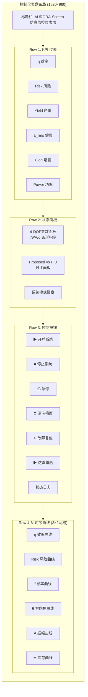

### 10.2 交互按钮功能

| 按钮 | 功能描述 | 回调行为 |
|------|---------|---------|
| ▶ 开启系统 | 系统启动 | 闪烁效果 + 启动序列日志 + msgbox确认 |
| ■ 停止系统 | 正常停机 | 确认对话框 → 降频/减料/停机日志 |
| ⚠ 急停 E-STOP | 紧急停机 | beep报警 + 立即停机 + warndlg |
| ⚙ 清洗筛面 | 筛面清洗 | 4阶段模拟: 停料→喷水→振动→恢复 |
| ↻ 故障复位 | 故障清除重启 | 确认 → 清除故障标志 → 恢复正常 |
| ▶ 仿真重启 | 重新运行仿真 | 确认 → 关闭仪表盘 → evalin('base','main_run') |

---

## 11. 核心公式推导

### 11.1 分离效率预测模型

**思路**: 以 q, v, f 为主导指标，结合扰动构造形状函数，叠加风险惩罚。

**形状函数** (高斯峰形，描述"接近最优工作点时效率更高"):

$$\text{shape} = \exp\left(-\left(\frac{q-q_0}{6}\right)^2 - \left(\frac{v-v_0}{0.16}\right)^2 - \left(\frac{f-f_0}{1.8}\right)^2\right)$$

**效率计算**:

$$\eta = 0.65 + 0.30 \cdot \text{shape} \cdot \text{pen}_{hard} \cdot \text{pen}_{big} \cdot \text{pen}_\rho$$

$$\eta = \eta - 0.12 \cdot \max\left(0, \frac{risk - r_{warn}}{50}\right)$$

其中 $q_0, v_0, f_0$ 随扰动变化，模拟最佳工作点漂移。

### 11.2 风险模型

**负载指标** (多因素加权):

$$\text{loadIdx} = 0.55 \cdot \frac{q}{20} + 0.35 \cdot \frac{M}{M_{max}} + 0.45 \cdot r_2 + 0.25 \cdot r_4$$

**风险映射** (Sigmoid，保证非线性饱和特性):

$$risk = 100 \cdot \frac{1}{1 + e^{-6(\text{loadIdx} - 0.65)}}$$

### 11.3 能耗模型

**皮带功率代理**:

$$P_{belt} = 2.0 v^2 + 0.6 \cdot \frac{q}{20} \cdot v$$

**激振功率代理**:

$$P_{vib} = 0.015 f^3 + 0.10 f$$

**总功率与单位能耗**:

$$P_{now} = P_{belt} + P_{vib}$$

$$\text{energy\_per\_ton} = \frac{\overline{P_{now}} \cdot T_{sim}}{\text{total\_ton}}$$

其中 $\text{total\_ton} = \int_0^{T_{sim}} q \, dt / 3600$

### 11.4 机械健康指标

$$\text{stress} = 0.45 \cdot \frac{f - f_{min}}{f_{max} - f_{min}} + 0.35 \cdot \frac{M}{M_{max}} + 0.20 \cdot \min(1, r_2/0.30) + 0.10 \cdot \min(1, r_4/0.12)$$

$$a_{rms} = 100 \cdot \text{stress} + \mathcal{N}(0, \sigma_{noise})$$

### 11.5 物理交互修正

#### 11.5.1 θ × 组分修正 (乘性惩罚)

**最优方向角随组分漂移**:

$$\theta_{opt} = \theta_{target} + k_{r2}(r_2 - r_{2,ref}) + k_{r3}(r_{block} - r_{block,ref})$$

**效率惩罚** (当 θ 偏离最优值):

$$\eta \leftarrow \eta \cdot \left(1 - p_\theta \cdot \left(1 - \exp\left(-\frac{(\theta - \theta_{opt})^2}{\sigma_\theta^2}\right)\right)\right)$$

参数: $p_\theta = 0.20$ (最大20%效率损失), $\sigma_\theta = 2.0°$

#### 11.5.2 A × 组分修正 (乘性惩罚)

$$A_{opt} = A_{target} + k'_{r3}(r_{block} - r_{block,ref}) + k_{r4}(r_{large} - r_{large,ref})$$

$$\eta \leftarrow \eta \cdot \left(1 - p_A \cdot \left(1 - \exp\left(-\frac{(A - A_{opt})^2}{\sigma_A^2}\right)\right)\right)$$

参数: $p_A = 0.15$ (最大15%效率损失), $\sigma_A = 1.0$ mm

#### 11.5.3 f × 组分修正 (加性 bonus)

$$f_{opt} = f_0 + k'_{r2}(r_2 - r_{2,ref}) + k'_{r4}(r_{large} - r_{large,ref})$$

$$\eta \leftarrow \eta + p_f \cdot \exp\left(-\frac{(f - f_{opt})^2}{\sigma_f^2}\right)$$

参数: $p_f = 0.04$ (匹配最优频率时效率加成4%)

### 11.6 滑模控制律

**滑模面定义**:

$$s = \dot{e} + \lambda e + \lambda_I e_I$$

**控制律**:

$$u_{raw} = K_p e + K_d \dot{e} + K_i e_I + W^T \phi(\xi) - K_s \tanh\left(\frac{s}{\epsilon}\right)$$

**耦合补偿后的最终控制**:

$$u = \hat{B}^{-1}(x) \cdot u_{raw}$$

**RBF 权重更新律**:

$$\dot{W} = \Gamma \cdot \phi \cdot s_{dz}^T - \sigma_w W$$

其中 $s_{dz}$ 是死区处理后的滑模面值，$\sigma_w$ 为 σ-modification 正则化系数。

### 11.7 库存动态模型

**质量守恒**:

$$M_{k+1} = M_k + (q_{in} - m_{out}) \cdot T_s$$

**出料率** (驻留时间模型):

$$m_{out} = \frac{M}{\tau_{res}}$$

其中 $\tau_{res}$ 受 f, v, 物料难度 (r2, r4) 和拥塞程度影响:
- 筛面效能: $\text{screenEff} = f(f, v, r_2, r_4)$
- 拥塞退化: 当 $M > 0.5 \cdot M_{max}$ 时线性退化
- 清洗提升: sw=1 时增加出料能力

### 11.8 决策层目标函数

$$J = w_\eta \eta - w_P \hat{P} - w_a \hat{a}_{rms} - w_{ept} \frac{\hat{P}}{\max(\epsilon, q_{ref})}$$
$$\quad - w_{qd}(q_{ref} - q_{cmd})^2 - w_{vd}(v_{ref} - v_{cmd})^2$$
$$\quad - w_{qt}(q_{ref} - q_t)^2 - w_{rb}(risk - risk_t)^2$$
$$\quad - \lambda_r [\max(0, risk - r_{warn})]^2$$

---

## 12. 符号表

| 符号 | 含义 | 单位/范围 |
|------|------|----------|
| η | 分离效率 | 0–1 |
| risk | 堵塞风险 | 0–100% |
| M | 箱体库存 | kg |
| q | 入料量 | t/h 或 kg/s |
| v | 皮带速度 | m/s |
| f | 振动频率 | Hz |
| θ | 振动方向角 | ° |
| A | 振幅 | mm |
| $q_{ref}, v_{ref}, f_{ref}$ | 参考设定值 | 各自单位 |
| $q_{cmd}, v_{cmd}, f_{cmd}$ | 控制指令值 | 各自单位 |
| $q_{act}, v_{eff}, f_{eff}$ | 实际执行值 | 各自单位 |
| $P_{belt}$ | 皮带功率代理 | W (代理) |
| $P_{vib}$ | 激振功率代理 | W (代理) |
| $P_{now}$ | 总功率代理 | W (代理) |
| energy_per_ton | 单位产量能耗 | W·s/ton |
| $a_{rms}$ | 机械健康指标 | 0–100 (代理) |
| $M_{max}$ | 最大库存容量 | 50 kg |
| $r_2, r_4$ | 难筛/大颗粒比例 | 0–1 |
| $r_{warn}$ | 风险预警阈值 | 28% |
| $r_{trip}$ | 风险跳闸阈值 | 60% |
| $r_{recover}$ | 风险恢复阈值 | 22% |
| yield | 产率 | t/h |
| clog | 堵孔率 | % |
| $B_0$ | 标称耦合矩阵 | 5×5 |
| $\hat{B}(x)$ | 在线估计耦合矩阵 | 5×5 |
| s | 滑模面 | — |
| $\phi_j$ | RBF基函数 | — |
| W | RBF权重矩阵 | N_rbf × 5 |
| Γ | 学习率矩阵 | — |
| sw | 清洗开关 | 0/1 |
| $T_s$ | 快速采样周期 | 0.2s |
| $T_{slow}$ | 慢速决策周期 | 60s |
| $T_{sim}$ | 仿真总时长 | 3600s |

---

## 13. 参数来源说明

### 13.1 结构来源

- **控制架构**: 源于分层控制思想——上游决策产生最优设定值，中层调度与约束确保安全可执行，下层执行层实现高精度跟踪
- **频率救援**: 源于工程经验——当 q/v 饱和且扰动严重时，频率提升是唯一可用的调节手段
- **逆向NN**: 源于数据驱动优化思想——将离线搜索到的最优映射关系压缩为可实时推理的神经网络

### 13.2 物理与经验参数

> **说明**: 这些参数不是"现场测量值"，而是**工程代理量**，用于逼近真实设备的约束与动态行为，确保仿真结果在工程上可解释。

- **电机/激振器特性**: 惯量 J、扭矩/功率上限、加速度限制为工程代理量，反映真实执行器约束
- **堵塞风险模型**: 采用物流拥塞类 Sigmoid 模型，反映真实机的非线性堵塞特性
- **库存动态**: 质量守恒 + 驻留时间模型，出料率受筛面效能和拥塞程度调制
- **机械健康 a_rms**: 由频率、负载、组分应力构建的代理量，体现磨损趋势

### 13.3 控制权重与阈值

- **目标函数权重** $(w_\eta, w_P, w_a, w_{ept})$: 通过离线调参与扫参确定，使效率与安全达到帕累托最优
- **能耗/吨阈值**: 来自能效基准或工艺目标区间
- **风险阈值**: $r_{warn}=28\%$, $r_{trip}=60\%$, $r_{recover}=22\%$，基于安全策略设定

### 13.4 训练数据

- **WOA-BP 数据集**: 150组实验数据 (CSV)，包含9输入3输出
- **逆向训练数据**: 3000组随机组分 × 27,783参数组合穷举搜索，选取最优解
- **数据增强**: 8倍噪声扩充 (5%高斯噪声)，提升小样本泛化能力

### 13.5 WOA-BP 标称值 (参考组分)

| 参数 | 标称值 | 来源 |
|------|--------|------|
| 易筛粒占比 | 69.29% | WOA-BP优化 |
| 难筛粒占比 | 12.80% | WOA-BP优化 |
| 阻塞粒占比 | 3.63% | WOA-BP优化 |
| 大颗粒占比 | 14.28% | WOA-BP优化 |
| 脉石含量 | 20.47% | WOA-BP优化 |
| 标称频率 f_target | 14.30 Hz | WOA-BP优化 |
| 标称方向角 θ_target | 48.16° | WOA-BP优化 |
| 标称振幅 A_target | 3.0 mm | WOA-BP优化 |

---

## 14. 文件清单与接口说明

### 14.1 文件功能表

| 文件名 | 功能 | 调用关系 |
|--------|------|---------|
| `main_run.m` | 主入口：参数加载→训练→仿真→绘图 | 调用所有模块 |
| `project_defaults.m` | 参数中心 (200+字段) | 被 main_run, ablation_run 调用 |
| `build_disturbance.m` | 6阶段扰动序列生成 | 被 main_run 调用 |
| `build_model.m` | Simulink 模型程序化构建 | 被 main_run/run_case 调用 |
| `ctrl_step.m` | 控制器主回调 (FSM+决策+调度+执行) | Simulink MATLAB Fcn |
| `decision_layer.m` | 上层决策 (NN/Grid/BP/Rule) | 被 ctrl_step 调用 |
| `freq_scheduler.m` | 频率调度与治理 | 被 ctrl_step 调用 |
| `rbf_asmc_controller.m` | RBF-ASMC 5通道执行层 | 被 ctrl_step 调用 |
| `plant_step.m` | 物理过程数字孪生 | Simulink MATLAB Fcn |
| `surrogate_predict.m` | NN/线性代理模型推理 | 被 decision_layer, plant_step 调用 |
| `train_surrogate_from_xlsx.m` | 岭回归代理模型训练 | 被 main_run 调用 |
| `bp_decision.m` | BP神经网络决策 (轻量) | 被 decision_layer 调用 |
| `control_dashboard.m` | 交互式监控仪表盘 | 被 main_run 调用 |
| `ablation_run.m` | 消融实验 (7案例) | 独立入口 |
| `vib_sep_sim.slx` | Simulink 模型文件 | 由 build_model 生成 |

### 14.2 数据流向图

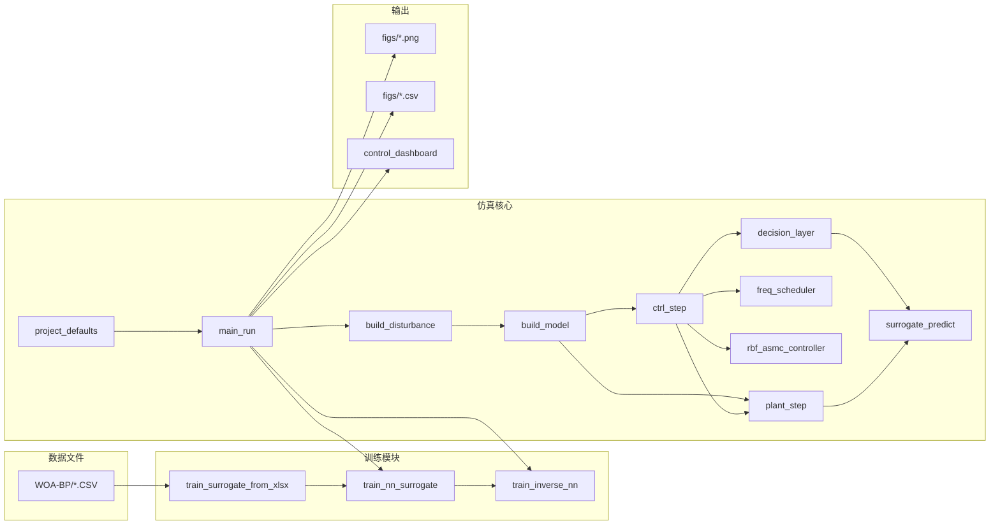

### 14.3 输出文件

仿真完成后自动生成以下文件（保存于 `figs/` 目录）：

| 文件类型 | 文件名示例 | 内容 |
|---------|-----------|------|
| PNG图表 | cmp_eta.png | 效率对比时序图 |
| CSV数据 | cmp_eta.csv | 效率时序原始数据 |
| PNG图表 | cmp_risk.png | 风险对比时序图 |
| CSV数据 | cmp_risk.csv | 风险时序原始数据 |
| PNG图表 | dist_profile.png | 扰动序列图 |
| CSV数据 | dist_profile.csv | 扰动原始数据 |
| PNG图表 | cmp_power.png | 功率对比图 |
| CSV数据 | cmp_power.csv | 功率原始数据 |
| PNG图表 | adaptive_4dof.png | 4-DOF参数自适应图 |
| CSV数据 | adaptive_4dof.csv | 4-DOF参数数据 |
| PNG图表 | cmd_v.png | 皮带速度跟踪图 |
| CSV数据 | cmd_v.csv | 速度跟踪数据 |
| PNG图表 | trade_eta_arms.png | η-a_rms权衡散点图 |
| CSV数据 | trade_eta_arms.csv | 权衡散点数据 |
| PNG图表 | conclusion.png | 综合结论页 |
| CSV数据 | conclusion_metrics.csv, conclusion_tradeoff.csv | 结论数据 |
| PNG图表 | dashboard.png | 控制仪表盘截图 |

---

> **文档结束** | AURORA-Screen v3.0 技术报告
